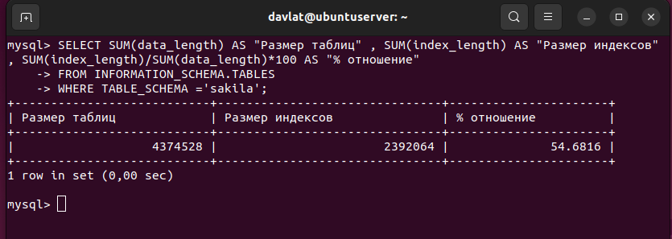
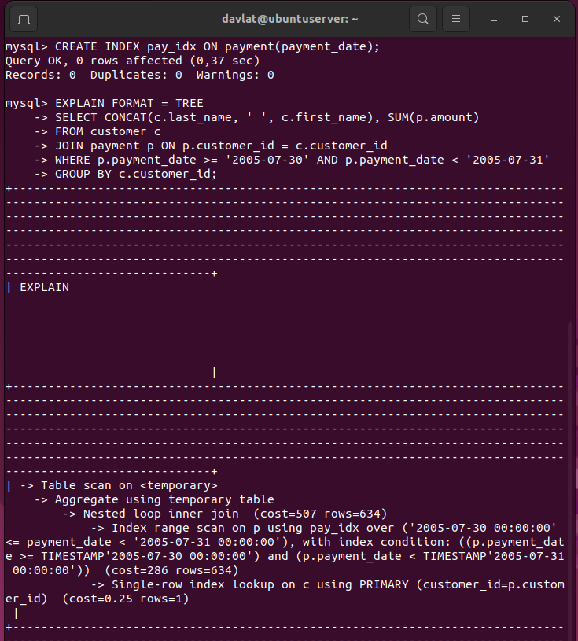

# "Домашнее задание к занятию «Индексы»" - Файзиев Давлат.

### Задание 1

Напишите запрос к учебной базе данных, который вернёт процентное отношение общего размера всех индексов к общему размеру всех таблиц.

### Решение 1

Cкриншот запроса:



---
### Задание 2

Выполните explain analyze следующего запроса:
```sql
select distinct concat(c.last_name, ' ', c.first_name), sum(p.amount) over (partition by c.customer_id, f.title)
from payment p, rental r, customer c, inventory i, film f
where date(p.payment_date) = '2005-07-30' and p.payment_date = r.rental_date and r.customer_id = c.customer_id and i.inventory_id = r.inventory_id;
```
- перечислите узкие места;
- оптимизируйте запрос: внесите корректировки по использованию операторов, при необходимости добавьте индексы.

### Решение 2

Узкие места запроса:
- применение оконной функции совместно с DISTINCT
- составные условия в WHERE

Добавление индекса в таблицу payment не дало существенного прироста в быстродействии.

Cкриншот оптимизированного запроса:



---

## Дополнительные задания (со звёздочкой*)
Эти задания дополнительные, то есть не обязательные к выполнению, и никак не повлияют на получение вами зачёта по этому домашнему заданию. Вы можете их выполнить, если хотите глубже шире разобраться в материале.

### Задание 3*

Самостоятельно изучите, какие типы индексов используются в PostgreSQL. Перечислите те индексы, которые используются в PostgreSQL, а в MySQL — нет.

*Приведите ответ в свободной форме.*

### Решение 3

Сравнительная таблица используемых индексов:

 | Тип индекса | PostgreSQL | MySQL |
 | ----------- | ---------- | ----- |
 | B-Tree      | +          | +     |
 | R-Tree      | -          | +     |
 | HASH        | +          | +     |
 | GiST        | +          | -     |
 | SP-GiST     | +          | -     |
 | GIN         | +          | -     |
 | BRIN        | +          | -     |
 | INVERTED    | -          | +     |

---
